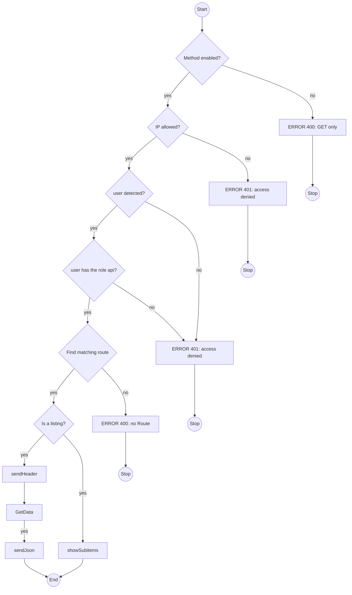

# API (WIP) #

With the API you have read only access to information. Only GET requets are supported.

You get a result as JSON object.

## Installation ##

A non pretty url does not need any configuration on a webserver.

`https://www.example.com/api/?&request=[API-URL]`

Optional - but recommended:

To use pretty urls like `https://www.example.com/[API-URL]` you need a rewrite rule. This is an example for Apache httpd:

```txt
<location /api>
    ...
    RewriteEngine on
    RewriteCond %{REQUEST_FILENAME} !-f
    RewriteRule /api(/.*)$ index.php?request=$1
</location>
```

## How does it work? ##



## Usage ##

To access the most data data we start with the api version `/v1`.
You get a list of allowed subitems to add.

In the urls below are placeholders with a starting @ character; optionally followed by ":" and a regex that must be matched.

To access application results we use the `/v1/apps` path.

Route                        | Description
-----------------------------| --------------
/                            | show help
/health                      | get health status
/v1/apps/id                  | list existing apps
/v1/apps/id/[appid]/[dataset]| With app id you can show a show data 
/v1/apps/tags                | List existing tags in all apps
/v1/apps/tags/[tag]/[dataset]| show data of all matching apps

Variable  | Description
----------|-------------
appid     | is a md5 hash (0-9 and a-f)
tag       | A tag contains letters and digits (a-z, A-Z, 0-9); multiple tags can be seperated with "," (comma) without space.
dataset   | is one of (meta\|checks\|all)

### Health ###

The health check is done by a request to `/api/health`. It sends 

* healt status if the application is up and running
* monitoring status of all apps

```txt
{
    "health": {
        "status": "OK",
        "statusmessage": "Appmonitor is up and running."
    },
    "monitoring": {
        "status": 0,
        "statusmessage": "OK",
        "apps": {
            "count": 8,
            "0": {
                "count": 7,
                "label": "OK"
            },
            "1": {
                "count": 0,
                "label": "Unknown"
            },
            "2": {
                "count": 1,
                "label": "Warning"
            },
            "3": {
                "count": 0,
                "label": "Error"
            }
        }
    }
}
```

### Application results ###

Detailed description:

* `/v1/apps/id` lists monitored applications. You need the key to fetch data of a single aplication.

  * `/v1/apps/id/@appid:[0-9a-f]*` - with adding the appid you get a list of possible data to fetch. The appid is a md5 hash.

    * `/v1/apps/id/@appid:[0-9a-f]*/meta` returns smallest result set with application name and its status.

    * `/v1/apps/id/@appid:[0-9a-f]*/checks` returns all performed checks for the application.

    * `/v1/apps/id/@appid:[0-9a-f]*/all` returns the largest result set with all metadata and checks. Next to the data from /meta or /checks you get more details like summary, timestamp of result, http response header.

* `/v1/apps/tags` lists tags of all applications

  * `/v1/apps/tags/@tags:[a-zA-Z,0-9\-]*` - with adding a tag - or a taglist seperated with "," - it lists with adding the appid you get a list of possible data to fetch.

    * `/v1/apps/tags/@tags:[a-zA-Z,0-9\-]*/meta` returns smallest result set with application name and its status.

    * `/v1/apps/tags/@tags:[a-zA-Z,0-9\-]*/checks` returns all performed checks for the application.

    * `/v1/apps/tags/@tags:[a-zA-Z,0-9\-]*/all` returns the largest result set with all metadata and checks. Next to the data from /meta or /checks you get more details like summary, timestamp of result, http response header.

### Tags ###

`/va/tags/` shows a list of the tags that are in use in all applications.

## Response ##

A valid api request has the http status code 200.

If you get an 40x statuscode it is an error. You get a json with the keys "http" and a key "error".

Statuscode | Description
-----------|--------------
200        | OK.
400        | Bad request. No Route was found. Maybe a route is wrong or a variable did not match the required regex.
401        | Not authorized. Your ip is not allowed to access the api.
403        | Access denied. A valid user was not detected or user has no permissions.
