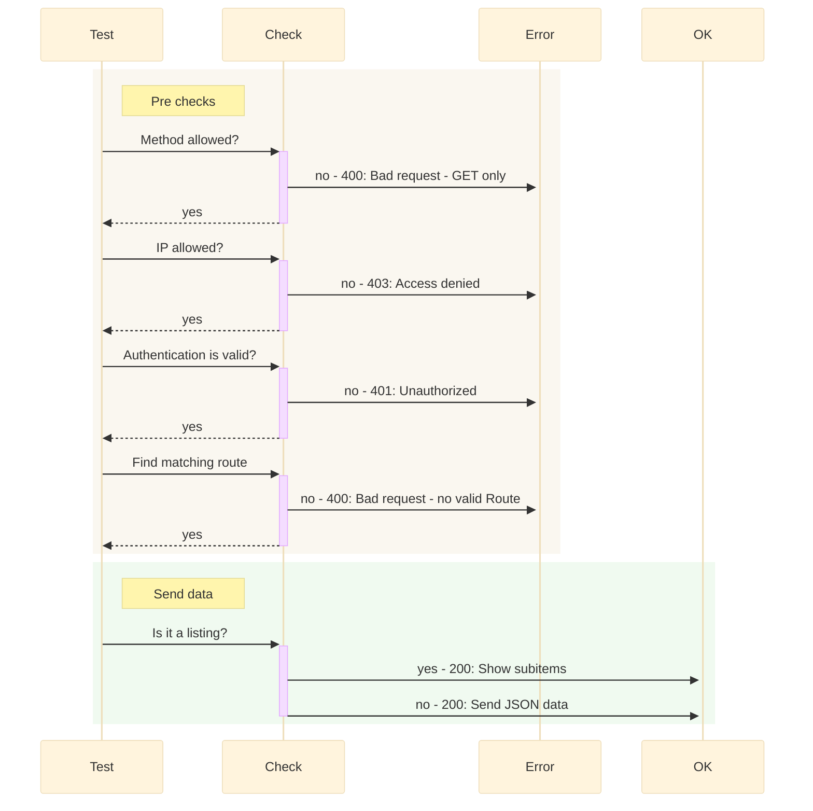

## Introduction

With the API you have read only access to information. Only GET requets are supported.

You get a result as JSON object.

## Installation

A non pretty url does not need any configuration on a webserver.

`https://www.example.com/api/?&request=[API-URL]`

Optional - but recommended:

To use pretty urls like `https://www.example.com/[API-URL]` you need a rewrite rule. This is an example for Apache httpd:

```txt
<location /api>
    ...
    RewriteEngine on
    RewriteCond %{REQUEST_FILENAME} !-f
    RewriteRule /api(/.*)$ index.php?request=$1
</location>
```

## How does it work?



## Usage

To access the most data data we start with the api version `/v1`.
You get a list of allowed subitems to add.

In the urls below are placeholders with a starting @ character; optionally followed by ":" and a regex that must be matched.

To access application results we use the `/v1/apps` path.

Route                         | Description
------------------------------| --------------
/                             | show help
/health                       | get health status
/v1/apps/id                   | list existing apps
/v1/apps/id/[appid]/[dataset] | With app id you can show a show data
/v1/apps/tags                 | List existing tags in all apps
/v1/apps/tags/[tag]/[dataset] | show data of all matching apps

Variable  | Type   | Description
----------|--------| -------------
appid     | string | is a md5 hash (0-9 and a-f)
tag       | string | A tag contains letters and digits (a-z, A-Z, 0-9); multiple tags can be seperated with "," (comma) without space.
dataset   | string | is one of (meta\|checks\|all)

### Health

The health check is done by a request to `/api/health`. It sends

* healt status if the application is up and running
* monitoring status of all apps

```txt
{
    "health": {
        "status": "OK",
        "statusmessage": "Appmonitor is up and running."
    },
    "monitoring": {
        "status": 0,
        "statusmessage": "OK",
        "apps": {
            "count": 8,
            "0": {
                "count": 7,
                "label": "OK"
            },
            "1": {
                "count": 0,
                "label": "Unknown"
            },
            "2": {
                "count": 1,
                "label": "Warning"
            },
            "3": {
                "count": 0,
                "label": "Error"
            }
        }
    }
}
```

Section `"health"`

Variable        | Type   | Description
----------------|--------| -------------
`status`        | string | "OK" if the application is running or "error"
`statusmessage` | string | Messagetext

Section `"monitoring"`

Variable        | Type   | Description
----------------|--------| -------------
`status`        | int    | Total status over all monitored applications 0=OK ... 4=Error; -1= no data available
`statusmessage` | string | Messagetext
`apps`          | array  | Array with count of monitored apps by their status 0=OK ... 4=Error and "count" for total

### Explre application results

Detailed description:

* `/v1/apps/id` lists monitored applications. You need the key to fetch data of a single aplication.

  * `/v1/apps/id/@appid:[0-9a-f]*` - with adding the appid you get a list of possible data to fetch. The appid is a md5 hash.

    * `/v1/apps/id/@appid:[0-9a-f]*/meta` returns smallest result set with application name and its status.

    * `/v1/apps/id/@appid:[0-9a-f]*/checks` returns all performed checks for the application.

    * `/v1/apps/id/@appid:[0-9a-f]*/all` returns the largest result set with all metadata and checks. Next to the data from /meta or /checks you get more details like summary, timestamp of result, http response header.

* `/v1/apps/tags` lists tags of all applications

  * `/v1/apps/tags/@tags:[a-zA-Z,0-9\-]*` - with adding a tag - or a taglist seperated with "," - it lists with adding the appid you get a list of possible data to fetch.

    * `/v1/apps/tags/@tags:[a-zA-Z,0-9\-]*/meta` returns smallest result set with application name and its status.

    * `/v1/apps/tags/@tags:[a-zA-Z,0-9\-]*/checks` returns all performed checks for the application.

    * `/v1/apps/tags/@tags:[a-zA-Z,0-9\-]*/all` returns the largest result set with all metadata and checks. Next to the data from /meta or /checks you get more details like summary, timestamp of result, http response header.

### Tags

`/va/tags/` shows a list of the tags that are in use in all applications.

## Response

### Status codes

A valid api request has the http status code 200.

If you get an 40x statuscode it is an error. You get a json with the keys "http" and a key "error".

Statuscode | Description
-----------|--------------
200        | OK.
400        | Bad request. No Route was found. Maybe a route is wrong or a variable did not match the required regex.
401        | Not authorized. No user was given or authentication failed.
403        | Access denied. Your ip is not allowed to access the api.

### Data

The response is always JSON. Depending on your configuration it uses pretty print.

#### /api/v1

This request has no data and responds the possible next levels.

```json
{
    "allowed_subkeys": [
        "apps",
        "tags"
    ]
}
```

Key               | Type   | Description
------------------|--------|--------------
`allowed_subkeys` | string | Description of data
\<values\>        | string | Possible next level subdirs

#### /api/v1/apps

This request has no data and responds the possible next levels.

```json
{
    "allowed_subkeys": [
        "id",
        "tags"
    ]
}
```

Key               | Type   | Description
------------------|--------|--------------
`allowed_subkeys` | string | Description of data
\<values\>        | string | Possible next level subdirs

#### /api/v1/apps/id

List all apps in appmonitor.

```json
{
    "60b1104800798cd79b694ca6f6764c15": {
        "website": "Appmonitor server"
    },
    "<id>": {
        "website": "<label>"
    }
}
```

Key       | Type   | Description
----------|--------|--------------
\<key\>   | string | The first key is the application id.
`website` | string | a label for the web application

#### /api/v1/apps/id/\<id\>

This request has no data and responds the possible next levels.

```json
{
    "allowed_subkeys": [
        "all",
        "appid",
        "checks",
        "meta",
        "public"
    ]
}
```

Key               | Type   | Description
------------------|--------|--------------
`allowed_subkeys` | string | Description of data
\<values\>        | string | Possible next level subdirs

#### /api/v1/apps/id/\<id\>/all

```json
{
    "60b1104800798cd79b694ca6f6764c15": {
        "meta": {
            "host": "60875f13b371",
            "website": "Appmonitor server",
            "ttl": 300,
            "result": 0,
            "time": "3.868ms",
            "version": "php-client-v0.137",
            "tags": [
                "monitoring"
            ]
        },
        "checks": [
            {
                "name": "write to .\/tmp\/",
                "description": "Check cache storage",
                "group": "folder",
                "parent": null,
                "result": 0,
                "value": "file test [\/var\/www\/appmonitor\/public_html\/server\/tmp]  flags OK: dir=yes|writable=yes ",
                "type": false,
                "time": "0.153ms"
            },
            {
                "name": "write to .\/config\/",
                "description": "Check config target directory",
                "group": "folder",
                "parent": null,
                "result": 0,
                "value": "file test [\/var\/www\/appmonitor\/public_html\/server\/config]  flags OK: dir=yes|writable=yes ",
                "type": false,
                "time": "0.027ms"
            },
            {
                "name": "check config file",
                "description": "The config file must be writable",
                "group": "file",
                "parent": "write to .\/config\/",
                "result": 0,
                "value": "file test [\/var\/www\/appmonitor\/public_html\/server\/config\/appmonitor-server-config.json]  flags OK: file=yes|writable=yes ",
                "type": false,
                "time": "0.024ms"
            },
            {
                "name": "PHP modules",
                "description": "Check needed PHP modules",
                "group": "service",
                "parent": null,
                "result": 0,
                "value": "OK: Required: curl=OK;",
                "type": false,
                "time": "0.086ms"
            },
            {
                "name": "http to server\/config",
                "description": "Check if the server\/config directory is not accessible (counts as warning on fail)",
                "group": "deny",
                "parent": null,
                "result": 0,
                "value": "OK: http check \"http:\/\/localhost:80\/\/server\/config\/readme.md\".<br>Http status: 403 - compare OK<br>",
                "type": false,
                "time": "0.870ms"
            },
            {
                "name": "http to server\/tmp",
                "description": "Check if the server\/tmp directory is not accessible (counts as warning on fail)",
                "group": "deny",
                "parent": null,
                "result": 0,
                "value": "OK: http check \"http:\/\/localhost:80\/\/server\/tmp\/readme.md\".<br>Http status: 403 - compare OK<br>",
                "type": false,
                "time": "0.290ms"
            },
            {
                "name": "appcounter",
                "description": "Monitored apps",
                "group": "monitor",
                "parent": "check config file",
                "result": 0,
                "value": "Found monitored web apps: 3",
                "type": false,
                "time": "0.047ms",
                "count": 3,
                "visual": "simple"
            },
            {
                "name": "running service",
                "description": "Check if the service is running",
                "group": "service",
                "parent": null,
                "result": 2,
                "value": "Info: Service is NOT running. Apps are checked interactively only (if the appmonitor web ui is running). | Output: STATUS: Not running. Run file is outdated.\n",
                "type": false,
                "time": "0.008ms"
            },
            {
                "name": "plugin Load",
                "description": "current load",
                "group": "monitor",
                "parent": null,
                "result": 2,
                "value": "current load is: 1.93",
                "type": "counter",
                "time": "0.069ms",
                "count": 1.93,
                "visual": "line"
            }
        ],
        "result": {
            "ts": "1731673236",
            "result": 0,
            "host": "60875f13b371",
            "website": "Appmonitor server",
            "summary": {
                "total": 9,
                "0": 7,
                "1": 0,
                "2": 2,
                "3": 0
            },
            "ttl": 300,
            "url": "http:\/\/localhost\/client\/check-appmonitor-server.php",
            "header": "HTTP\/1.1 200 OK\r\nDate: Fri, 15 Nov 2024 12:20:36 GMT\r\nServer: Apache\/2.4.57 (Debian)\r\nCache-Control: cache\r\nmax-age: 300\r\nStrict-Transport-Security: max-age=63072000; includeSubDomains; preload\r\nX-Frame-Options: SAMEORIGIN\r\nX-Content-Type-Options: nosniff\r\nX-XSS-Protection: 1; mode=block\r\nFeature-Policy: sync-xhr 'self'\r\nReferrer-Policy: strict-origin-when-cross-origin\r\nContent-Length: 2493\r\nContent-Type: application\/json",
            "headerarray": {
                "_status": "HTTP\/1.1 200 OK",
                "_statuscode": "200",
                "Date": " Fri, 15 Nov 2024 12:20:36 GMT",
                "Server": " Apache\/2.4.57 (Debian)",
                "Cache-Control": " cache",
                "max-age": " 300",
                "Strict-Transport-Security": " max-age=63072000; includeSubDomains; preload",
                "X-Frame-Options": " SAMEORIGIN",
                "X-Content-Type-Options": " nosniff",
                "X-XSS-Protection": " 1; mode=block",
                "Feature-Policy": " sync-xhr 'self'",
                "Referrer-Policy": " strict-origin-when-cross-origin",
                "Content-Length": " 2493",
                "Content-Type": " application\/json"
            },
            "httpstatus": 200,
            "error": false,
            "curlerrorcode": 0,
            "curlerrormsg": "",
            "resultcounter": [
                30,
                0,
                0,
                0
            ]
        },
        "counters": {
            "_responsetime": {
                "title": "Antwortzeit [ms]",
                "visual": "bar",
                "status": 0,
                "value": 50
            },
            "time-PHPmodules-eea780ac76569f8b84b31309df945505": {
                "title": "timer for[Check needed PHP modules] in [ms]",
                "visual": "bar",
                "status": 0,
                "value": "0.120"
            },
            ...
        },
        "since": "1740560976",
        "state": {
            "result-soft": 0,
            "result-hard": 0,
            "result-hard-since": 1765365475,
            "lastresponses": [
                {
                    "timestamp": 1771417408,
                    "data": {
                        "status": 0,
                        "value": 51
                    }
                },
                {
                    "timestamp": 1771417709,
                    "data": {
                        "status": 0,
                        "value": 54
                    }
                },
                {
                    "timestamp": 1771418010,
                    "data": {
                        "status": 0,
                        "value": 57
                    }
                },
                {
                    "timestamp": 1771418311,
                    "data": {
                        "status": 0,
                        "value": 66
                    }
                },
                {
                    "timestamp": 1771418612,
                    "data": {
                        "status": 0,
                        "value": 57
                    }
                }
            ]
        }
    }
}
```

Key            | Type   | Description
---------------|--------|--------------
\<key\>        | string | The first key is the application id.
`meta`         | array  | Key for metadata
`checks`       | array  | Key for checks for this app
`result`       | array  | Key for response infos
`counters`     | array  | Key for app specific counters
`since`        | int    | DEPRECATED: Unix timestamp when the change to the current status was
`state`        | array  | Key for appplication state

!!! warning "Deprected"
    Do not use `'since '` anymore. It was replaced by `state -> hard-state-since`.

##### Subkeys in `"meta"` section:

These are the metadata for this application (like described in appmonitor client).

Key             | Type   | Description
----------------|--------|--------------
`host`          | string | hostname
`website`       | string | Name of the application
`ttl`           | int    | TTL in seconds sent from application for caching on the appmonitor server
`result`        | int    | total status from last check of the website (soft state); 0=OK ... 4=Error
`time`          | string | optional: time spent for performing checks on application side, eg "3.868ms"
`version`       | string | optional: Used client and version
`tags`          | array  | optional: list of tags

##### Items in `"checks"` section:

The section checks contains a list of single checks for this application.
Each check contains the client data for this check (like described in appmonitor client).

Key             | Type   | Description
----------------|--------|--------------
`name`          | string | Name of the check
`description`   | string | Description of the check
`group`         | string | optional: group
`parent`        | string | optional: reference to depending check \<name\>
`result`        | int    | status of the check; 0=OK ... 4=Error
`value`         | string | Return text of the check with description what was successful or what failed.
`time`          | string | optional: time for execution of this single check, eg "0.027ms"
`type`          | string | optional: type of tile to render; false or "counter"
`count`         | float  | optional: value to render in a tile
`visual`        | string | optional: output style for rendering data in a tile, eg "simple", "line"

##### Subkeys in `"result"` section:

This section contains a total status and http response informations.

Key             | Type   | Description
----------------|--------|--------------
`ts`            | int    | Unix timestamp of last fetched check
`result`        | int    | total status of the website; 0=OK ... 4=Error
`host`          | string | hostname
`website`       | string | Name of the application
`summary`       | array  | Array with counts of checks for this application by ist status. The subkeys are "total" and the return values 0=OK ... 4=Error
`ttl`           | int    | TTL in seconds sent from application for caching on the appmonitor server
`url`           | string | Requested url for the appmonitor status of the application
`header`        | string | raw response header as string with \r\n as divider
`headerarray`   | array  | parsed values from the response header. Keys are the response header names. Generated fields are "_status" (because its line has no variable) and "_statuscode" for the http status code
`httpstatus`    | int    | http status code
`error`         | bool   | Flag: http request is an http error?
`curlerrorcode` | int    | Curl error code
`curlerrormsg`  | string | Curl error message; for more details see see <https://curl.se/libcurl/c/libcurl-errors.html>

##### Subkeys in `"counters"` section:

Each app has a counter for response time. In dependency of the response they can have additional counters coming from its checks.
Every counter has a key (id of the counter) and data.

Key             | Type   | Description
----------------|--------|--------------
`title`         | string | Title of the counter
`visual`        | string | visualisation style, eg. "bar"
`status`        | int    | result of the corresponding check
`value`         | string | value of the counter.

##### Value `since`

Value in `"since"` key is a unix timestamp when the change to the current state was.

!!! warning "Deprected"
    Do not use `'since '`. It was replaced by `state -> hard-state-since`.

##### Subkeys in `"state"` section:

The state section has information about application state and last short history.

Key                 | Type   | Description
--------------------|--------|--------------
`result-soft`       | int    | Result of last applicatoin response
`result-hard`       | int    | Result of applicatoin - hard state; replacement for 'since'
`result-hard-since` | int    | Unix timestamp of last change of the hard state
`lastresponses`     | array  | Array of last 5 results and their response times in ms

#### /api/v1/apps/id/\<id\>/appid

Shows appids and the name only.

Key       | Type   | Description
----------|--------|--------------
\<key\>   | string | The first key is the application id.
`website` | string | a label for the web application

#### /api/v1/apps/id/\<id\>/checks

See request to `/all` data ... get checks section only.

#### /api/v1/apps/id/\<id\>/meta

See request to `/all` data ... get meta section only.

#### /api/v1/apps/id/\<id\>/public

Get a set of non sensitive meta information, the value "since" (DEPRECATED) and "state".

```json
{
    "60b1104800798cd79b694ca6f6764c15": {
        "meta": {
            "host": "81449a93a081",
            "website": "Appmonitor server",
            "result": 0,
            "ttl": 300
        },
        "since": "1740560976",
        "state": {
            "result-soft": 0,
            "result-hard": 0,
            "result-hard-since": 1765365475,
            "lastresponses": [
                {
                    "timestamp": 1771417408,
                    "data": {
                        "status": 0,
                        "value": 51
                    }
                },
                {
                    "timestamp": 1771417709,
                    "data": {
                        "status": 0,
                        "value": 54
                    }
                },
                {
                    "timestamp": 1771418010,
                    "data": {
                        "status": 0,
                        "value": 57
                    }
                },
                {
                    "timestamp": 1771418311,
                    "data": {
                        "status": 0,
                        "value": 66
                    }
                },
                {
                    "timestamp": 1771418612,
                    "data": {
                        "status": 0,
                        "value": 57
                    }
                }
            ]
        }
    }
}
```

#### /api/v1/apps/tags

Lists all tags from all applications in alphabetic order.

```json
{
    "tags": [
        "live",
        "monitoring"
    ]
}
```

Key             | Type   | Description
----------------|--------|--------------
tags            | string | Description of data
\<values\>      | string | Name of a tag; Possible next level subdirs

#### /api/v1/apps/tags/\<tag\>

This request has no data and responds the possible next levels.

```json
{
    "allowed_subkeys": [
        "all",
        "appid",
        "checks",
        "meta",
        "public"
    ]
}
```

Key               | Type   | Description
------------------|--------|--------------
`allowed_subkeys` | string | Description of data
\<values\>        | string | Possible next level subdirs

#### /api/v1/apps/tags/\<tag\>/all

List the full status of all applications matching the given tag.
The output is the same like described in **/api/v1/apps/id/\<id\>/all** - but with multiple application IDs.

```json
{
    "<id-1>": {
        "meta": { ... },
        "checks": [ ... ],
        "result": { ... },
        "since": <Unix timestamp>,
        "state": { ... },
    },
    "<id-2>": { ... },
    "<id-N>": { ... }
}
```

!!! info "Remark"
    You can use multiple tags too to list all apps with AND condition using a comma separated list.
    `/api/v1/apps/tags/<tag_1>,<tag_2>,<tag_N>/all`

#### /api/v1/apps/tags/\<tag\>/appid

Shows appids and the name only.

Key       | Type   | Description
----------|--------|--------------
\<key\>   | string | The first key is the application id.
`website` | string | a label for the web application

#### /api/v1/apps/tags/\<tag\>/checks

See request to `/all` data ... get checks section only.

#### /api/v1/apps/tags/\<tag\>/meta

See request to `/all` data ... get meta section only.

#### /api/v1/apps/tags/\<tag\>/public

Get a set of non sensitive meta information, the value "since" (DEPRECATED) and "state".

#### /api/v1/tags

List all tags.

```json
{
    "tags": [
        "live",
        "monitoring"
    ]
}
```

Key             | Type   | Description
----------------|--------|--------------
tags            | string | Description of data
\<values\>      | string | Tag name

!!! info "Remark"
    To browse by tag you need to continue with
    `/api/v1/apps/tags/<tag>`
