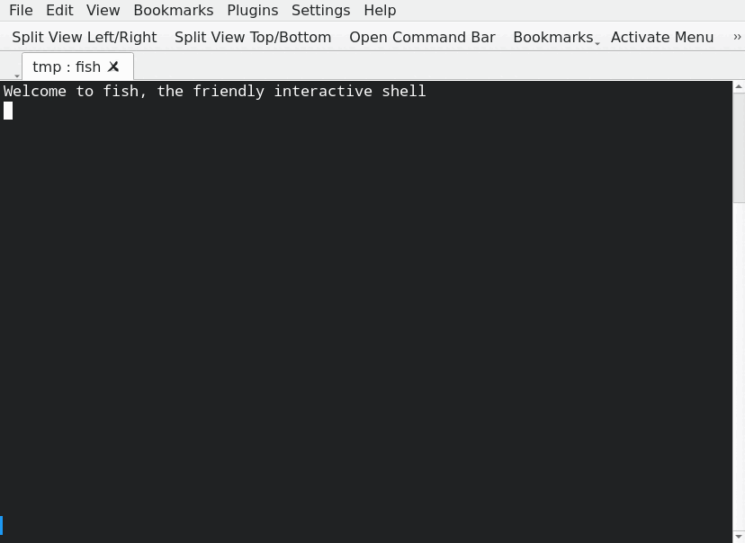
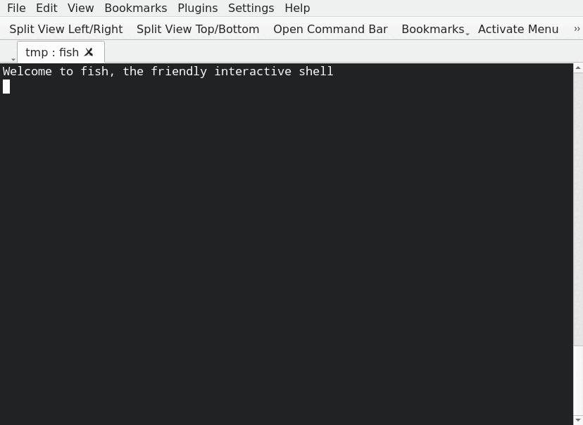

## Get started

The project package contains the PHP client and the server.

If you run an application, CMS, Blog, ... and if it is using PHP then you need the client part only.

## Install with a script

There is a script in `public_html/client/git_update_appmonitor.sh` that automates the manual steps above.
It acts linke an installer and updater.

This is the fastest way to install and keep files up to date.

Requirements for the installer:

- Bash
- rsync
- git

### Get the installer

1) Below the document root of a website create a new directory, i.e. [webroot]/appmonitor/
2) Copy git_update_appmonitor.sh there or fetch it as raw file

    ```shell
    wget -O git_update_appmonitor.sh https://raw.githubusercontent.com/iml-it/appmonitor/master/public_html/client/git_update_appmonitor.sh
    ```

    OR

    ```shell
    curl -o git_update_appmonitor.sh https://raw.githubusercontent.com/iml-it/appmonitor/master/public_html/client/git_update_appmonitor.sh`
    ```

3) Set execute permissions `chmod 755 git_update_apmonitor.sh`

The Video shows the installation "somewhere":



`./git_update_appmonitor.sh -h` shows a help.

```text

          +-----------------------------------+
          |                                   |
          |  INSTALLER  |                     |
          |      +      |  Appmonitor client  |
          |   UPDATER   |                     |
          |                                   |
          +--------------------------- v0.2 --+


    This is a helper script to get the files of the IML Appmonitor
    client part only.

    This script clones and updates the repository in the /tmp 
    directory and syncs the client files of it to a given directory.

    In the first run it works like an installer.
    On additional runs it updates the files.

    USAGE:

    ./git_update_appmonitor.sh [target path]

        default target is [.] (current directory)

    ./git_update_appmonitor.sh -h|--help

        Show this help.

```

### First run: install

Install files by executing it: `./git_update_appmonitor.sh`.

The Video shows the first run of the installer:



## Manual installation

### Get sources

Get the files

- with git pull or
- download and extract the archive in a temporary directory

### Copy needed files

Copy the files of subdir "client" from [package]/public_html/.

1) Below the document root of a website create a new directory, i.e. [webroot]/appmonitor/
2) copy all files of subdir "client" from [package]/public_html/client/ into [webroot]/appmonitor/
