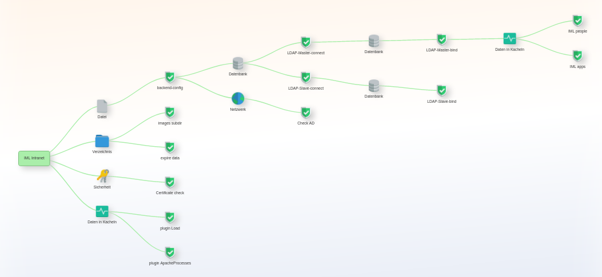

## Check functions in detail

A check makes a single test like verify if a file exists, a database can be connected and so on. A check will be added with `$oMonitor->addCheck(...)`. You can add as many checks as you want.

You should start with a simple check.

And I suggest to add many checks to verify in many details if your application has all requirements to run. You can chain the checks - then it becomes tool to to detect fast if something is not running and why.

The available checks are the files in public_html/client/plugins/checks/.

## General include of a check

Have a look to Let's have a look to public_html/client/index.sample.php.

You can add all checks after initializing the appmonitor-client class that
is initialized on top of the file.

The class has a render() method that generates the json for you. It must be at the end.

In the area between `$oMonitor = new appmonitor();` and `render();` you can place
as many checks you want.

The syntax is

```php
// init (just once needed)
require_once('classes/appmonitor-client.class.php');
$oMonitor = new appmonitor();

// ...

// now you can use addCheck() multiple times.
$oMonitor->addCheck(
  [
    "name" => "[short name of the check]",
    "description" => "[an a bit longer description]",
    "group" => "[optional: name of a group]",
    "parent" => "[optional: reference a name of another check]",
    "check" => [Array for the check],
    "worstresult" => RESULT_WARNING
  ]
);
```

| key          | type     | description
|---           |---       |---
|name🔸        |(string)  | "id" if the check
|description🔸 |(string)  | a short description
|group         |(string)  | optional override name of a group
|parent        |(string)  | optional set a "name" of another check to create a deoendency chain; without parent do not use this key or set it to `null`.
|check🔸       |(array)   | check to perform
|worstresult   |(integer) | optional: limit maximum error level if the check fails; if the check should fail then its result is an error - but this check is not highly relevant for a running application then you can override the influence to the total result set a maximum level i.e. RESULT_WARNING.

🔸 required

The key `check` contains 2 subkeys:

```php
  "function" => "[Name of a defined check]",
  "params" => [key->value array; count and keys depend on the function]
```

## Groups

This functionality has impact in the rendered view in the web ui only.

Without any group all check results are connected directly to the application node.

```text
+--------+          +---------+    
| My App +--------->| Check 1 |
+--------+ \        +---------+
           |\       +---------+
           | `----->| Check 2 |
           \        +---------+
            \       +---------+
             `----->| Check 3 |
                    +---------+  
```

By adding a group "in front" of a check a node for the group will be inserted. All checks of the same type will are connected with a group of checks.

Example:

The checks 1 + 2 get the group "file". Check 3 gets a group "database". The graphical view will change like this:

```text
+--------+          +--------+          +---------+    
| My App +--------->| File   +--------->| Check 1 |
+--------+ \        +--------+ \        +---------+
            |                   \       +---------+
            |                    `----->| Check 2 |
            |                           +---------+
             \      +-----------+       +---------+
              `---->| Database  +------>| Check 3 |
                    +-----------+       +---------+
```

A default group is set in all by default shipped checks.

You can override it by setting another group.

| Group      | Description
|---         |---
| cloud      | cloud icon
| database   | database icon
| deny       | deny sign
| disk       | hard disk icon
| file       | file icon
| folder     | folder icon
| monitor    | monitor graph icon
| network    | globe icon
| security   | keys icon
| service    | cogs icon

## Chaining with a parent

With a chaining value you can reference another check by giving its name value.

As an example: One of the first checks can be the check to read a config. In it are your database credentials. In the check the database access you set a reference to the config check as parent.

In the monitor web ui you get a rendered tree.


