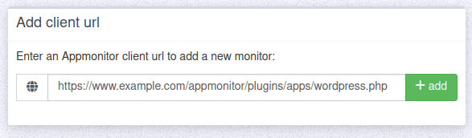

## Introduction

The following steps describe a first (and most simple) approach for an application monitoring with IML appmonitor. There are a few pre defined checks for some common applications below plugins/apps/ folder.

`https://www.example.com/appmonitor/plugins/apps/` + `[NAME]`+ `.php`

!!! info "Note"
    This is just a quick winner with most basic checks. 
    You cannot customize the builtin checks and influence a few metadata.

### Minimal variant

`curl -s https://www.example.com/appmonitor/plugins/apps/[NAME].php`

For NAME insert an existing filename for a product.

You can add the url parameter "?rel=[subdir]" to define another directory for the application. This is needed if your application isn't installed directly in the webroot but in a subfolder.

You got a JSON response? Then you can open the settings in Appmonitor server and add this url.

For finetuning check the following section for supported parameters.

### Url parameters

All application checks support the following url (GET) parameters for customization:

| Parameter | Description | Example
|--         |--           |--
| `rel`     | The relative path to the application root. Use this if your application is not installed directly in the webroot.| <https://www.example.com/appmonitor/plugins/apps/[NAME].php?rel=/myapp>
| `host`    | Set a custom name for the serving hostname. Use this override if the default hostname is unwanted.| <https://www.example.com/appmonitor/plugins/apps/[NAME].php?rel=/myapp&host=web01.example.com>
| `name`    | The name of the website or web application.| <https://www.example.com/appmonitor/plugins/apps/[NAME].php?rel=/myapp&name=Company%20CMS>
| `tags`    | A list of tags to add to the application. Multiple tags are separated with comma `,`| <https://www.example.com/appmonitor/plugins/apps/[NAME].php?rel=/myapp&tags=tag1.tag2>
| `dfc`    | Disk free critical level (see plugin diskfree) | <https://www.example.com/appmonitor/plugins/apps/[NAME].php?rel=/myapp&dfw=1000GB&dfc=600GB>
| `dfw`    | Disk free warning level (see plugin diskfree) | <https://www.example.com/appmonitor/plugins/apps/[NAME].php?rel=/myapp&dfw=1000GB&dfc=600GB>

## Errors

During the first steps when trying to find the right url you might get these errors:

* `Page Not found`

    **Problem**: You didn't point to the correct file.

    **Solution**: Fix the url to pint to the concrete5.php.

* `ERROR: The given rel dir does not exist below webroot.`

    **Problem**: You used the parameter rel=... but the given directory does not exist below webroot.

    **Solution**: Fix the value behind rel= and set it to an existing directory.
