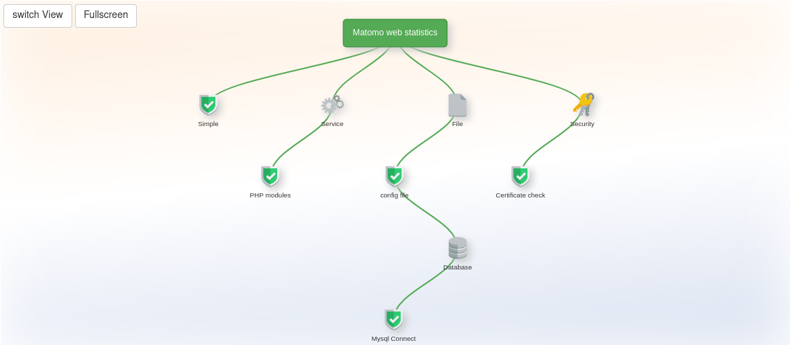

## Matomo

* Website: <https://matomo.org/>
* Author: Matomo Team
* Source: <https://github.com/matomo-org/matomo/>
* License: GNU General Public License 3

## Screenshot

Tree view of application default check with **5** items in the server web ui:

## Minimal variant

You can open .../appmonitor/plugins/apps/**matomo**.php as url like

<https://www.example.com/appmonitor/plugins/apps/matomo.php>

... or for a subfolder add the url parameter "?rel=[subdir]".

Example:

<https://www.example.com/appmonitor/plugins/apps/matomo.php?rel=/matomo>

You should get a JSON response.

## Errors

During the first steps when trying to find the right url you might get one of these check specific errors (Next to those named in the introduction page):

* `ERROR: Config file was not found. Set a correct $sApproot pointing to Matomo install dir`

    **Problem**: The application root was not found. Below it the file config/config.ini.php is expected.

    **Solution**: Use the parameter rel=... to set the correct subdir
