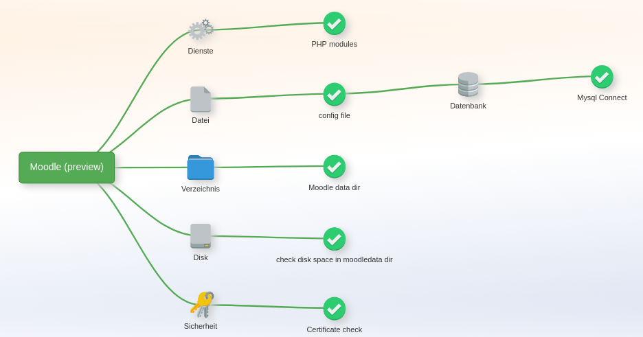

## Moodle

* Website: <https://moodle.org/>
* Author:
* Source: <https://github.com/moodle/moodle>
* License:  GPL-3.0 license

## Screenshot

Tree view of application default check with **6** items in the server web ui:

## Requirements

Moodle 5.x

## Minimal variant

You can open .../appmonitor/plugins/apps/**moodle**.php as url like

<https://www.example.com/appmonitor/plugins/apps/moodle.php>

... or for a subfolder add the url parameter "?rel=[subdir]".

Example:

<https://www.example.com/appmonitor/plugins/apps/moodle.php?rel=/moodle>

You should get a JSON response.

## Errors

During the first steps when trying to find the right url you might get one of these check specific errors (Next to those named in the introduction page):

* `ERROR: Config file [config.php] was not found. Set a correct app root pointing to Moodle install dir.`

    **Problem**: The application root was not found. On Moodle **5.1** One directory up the file config.php is expected. For Moodle 5.0 it must be found in the webroot.

    **Solution**: Use the parameter rel=... to set the correct subdir
