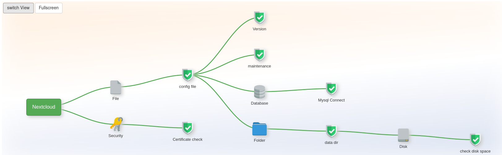

## Nextcloud server

Nextcloud offers a modern, on premise content collaboration platform with real-time document editing, video chat & groupware on mobile, desktop and web.

* Website: <https://nextcloud.com/>
* Author: Nextcloud GmbH
* Source: <https://github.com/nextcloud>
* License: GNU Affero General Public License v3.0

## Screenshot

Tree view of application default check with **7** items in the server web ui:

## Minimal variant

You can open .../appmonitor/plugins/apps/**nextcloud**.php as url like

<https://www.example.com/appmonitor/plugins/apps/nextcloud.php>

... or for a subfolder add the url parameter "?rel=[subdir]".

Example:

<https://www.example.com/appmonitor/plugins/apps/nextcloud.php?rel=/cloud>

You should get a JSON response.

## Errors

During the first steps when trying to find the right url you might get one of these check specific errors (Next to those named in the introduction page):

* `ERROR: Config file was not found. Use ?rel=/NAME or similiar to set a relative install dir.`

    **Problem**: The application root was not found. Below it the file config/config.php is expected.

    **Solution**: Use the parameter rel=... to set the correct subdir
