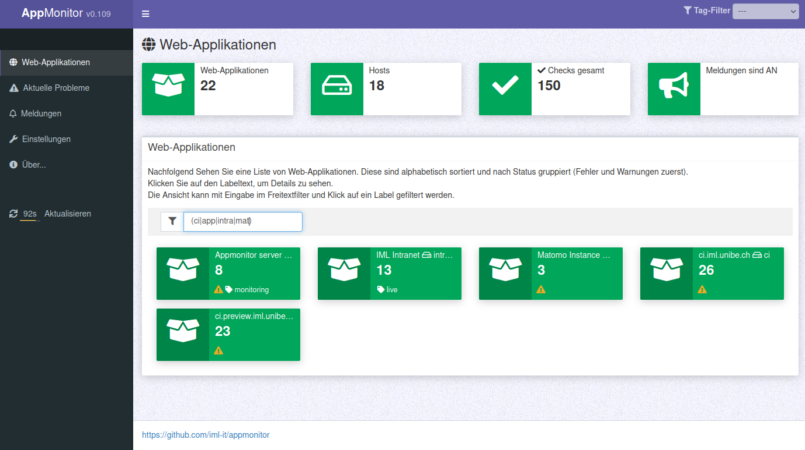
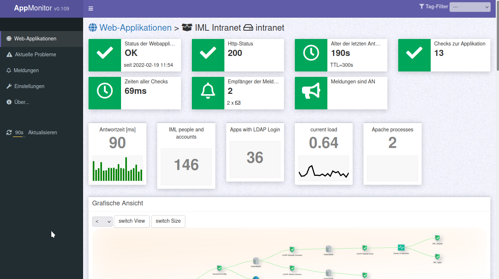

# APPMONITOR #

Free software and Open Source from University of Bern :: IML - Institute of Medical Education

📄 Source: <https://github.com/iml-it/appmonitor>

📜 License: GNU GPL 3.0

📖 Docs: <https://os-docs.iml.unibe.ch/appmonitor/>

- - -

# Description #

The application monitor is a complementing tool next to the classic system monitoring of servers and its services. It makes checks from the point of view of the application: with its credentials and permissions started on the application hosts.

# Installation / Get started #

Go to page [Server](10_Server/10_Installation.md) to install the server that contains the server and client components.

If you have a server already and want to monitor an PHP application then go to [PHP-Client](30_%F0%9F%93%83_PHP-client/10_Introduction.md).

# Features #

Server webgui

- Multi language (English and German language file so far)
- Optional service for permanent checks and notification 24/7
- Notification as email, Slack message (respecting sleep times i.e. during the night)
- Filter the view by selecting tags
- CLI tool to automate settings in the server config (with Puppet, Ansible, ...)

Client data

- have meta data with global application status and a separate section for all single checks
- define the user groups to notify if the application status changes
- define tags that will be visible in the server ui to filter by a group of application types or departments or other logic
- chaining: with naming a parent you can create a dependency tree of checks

## Screenshots ##

