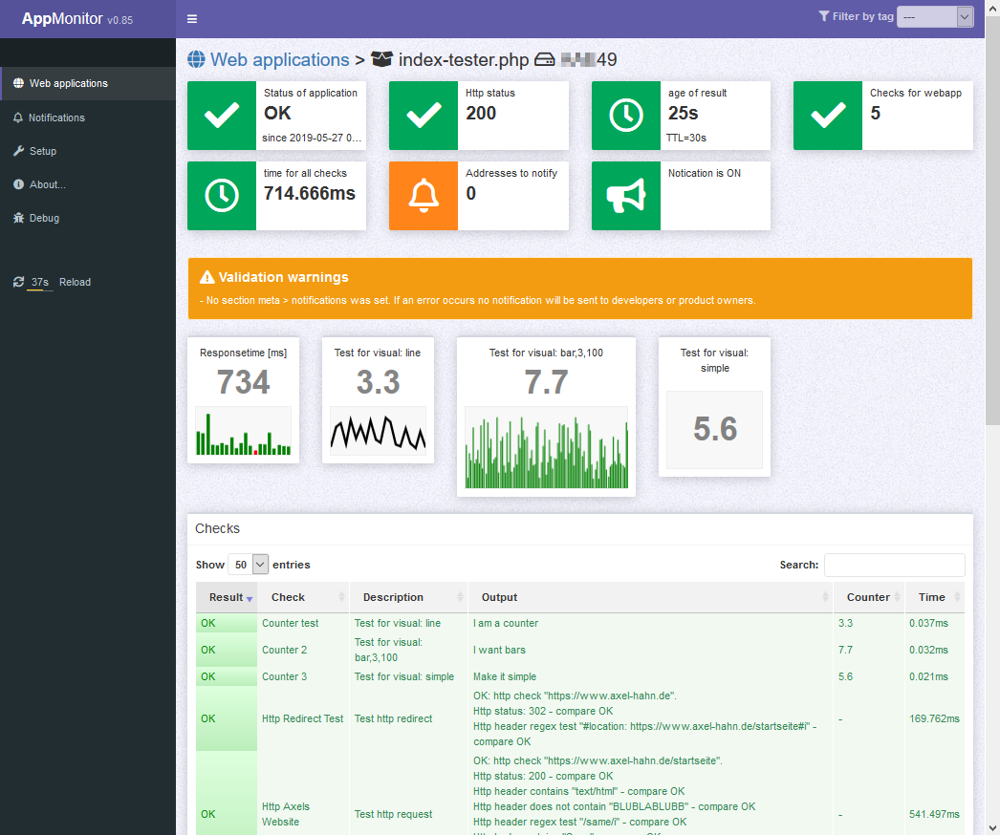

[TOC]
# APPMONITOR #

Free software and Open Source from University of Bern :: IML - Institute of Medical Education

https://github.com/iml-it/appmonitor

- - -

# Description #

The application monitor is an additional tool to the classic system monitoring of a servers and its services. It makes checks from the point of view of the application. With its credentials and permissions started on the application hosts.

# Installation / Get started #

Go to page [Server](10_Server/10_Installation.md) to install the server that contains the server and client components.

# Features #

- PHP 7 or 8 on server (clients can be implemented in other languages too)
- small: less 1 MB + docs; no database required

Server webgui

- Multi language (English and German language file so far)
- Optional service for permanent checks and notification 24/7
- Notification as email, Slack message (respecting sleep times i.e. during the night)
- Filter the view by selecting tags
- CLI tool to automate settings in the server config (with Puppet, Ansible, ...)

**Screenshot**:

