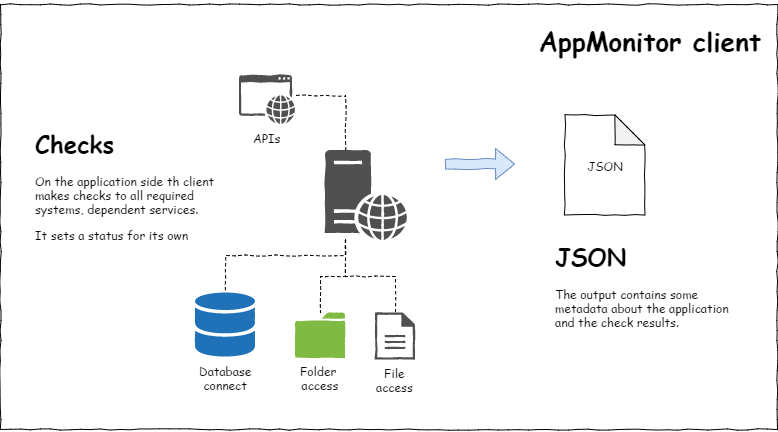
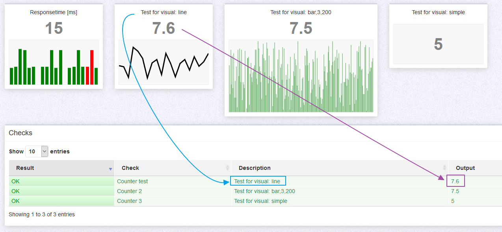

<style>
	.required{color:#f22;}
	.optional{color:#888;}
</style>


# [APPMONITOR](readme.md) > CLIENT #

Free software and Open Source from University of Bern :: IML - Institute of Medical Education

https://github.com/iml-it/appmonitor

- - -


# How does it work? #


The main idea is to make the checks with permissions of the application and with its credentials. Check if directories or files are writable, a connection to services like databases, email, external http APIs/ ressources, ... whatever.

An application check finally creates a JSON in a predefined structure.




# Requirements #

For the delivered PHP client:
- PHP7 (up to PHP 7.3; runs on php5 but is not supported) \
  see [PHP-Client](client-php.md)

You can implement a client in other languages.


# Description of metadata / NON-PHP clients #

If you dont use php on your webserver you can create your own client that 
returns JSON answers with the conventions described below.

```json
{
    "meta": {
        "host": "[{string} name of the computer]", 
        "website": "[{string} description of the webapp]", 
        "ttl": [{integer} ttl for the server gui],
        "result": [{integer}: 0..3],
        "tags": [
            "[{string} tag 1]",
            "[{string} tag N]"
        ],
        "time": "[{float} value]ms",
        "notifications": {
            "email": [
                "[{string} email_1@example.com]",
                "[{string} email_N@example.com]"
            ],
            "slack": {
                "#dev-channel": "[{string} https:\/\/hooks.slack.com\/services\/AAAAA\/BBBBB\/CCCCCC]",
                "#productowner-channel": "[{string} https:\/\/hooks.slack.com\/services\/XXXXXX\/YYYYYY\/ZZZZZ]"
                }
            }
        }
    }, 
    "checks": [
        {
            "name": "[{string}: short name of the test 1]", 
            "description": "[{string}: a description what the test is verifying]", 
            "result": [{integer}: 0..3]
            "value": "[{string}: result in words or {float} value for type=counter]",
            "time": "[{float} value]ms"
            "count": "[{float} counter value]"
            "visual": "[{string} bar|line|simple[,options]]"
        },
        ...
        {
            "name": "[{string}: short name of the test N]", 
            "description": "[{string}: a description what the test N is verifying]", 
            "result": [integer: 0..3]
            "value": "[{string}: result in words]" 
            "time": "[value]ms"
            "count": "[{float} counter value]"
            "visual": "[{string} bar|line|simple[,options]]"
        }
    ] 
}
```

The response has 2 keys:

- meta: metadata for the check
- checks: container for all checks

## meta ##

The meta key has these subkeys

- *"host"*: [string: name of the computer] <span class="required">(*)</span>\
  This is the hostname. The server GUI for the monitoring can group by server. 
  If you host several websites then these have the same "host".
- *"website"*: [string: domain (and maybe path) of the webapp or any clear description. <span class="required">(*)</span>\
  Suggestion: [Application] - [vhost]/path, i.e. "My Wordpress blog - example.com/blog/".
- *"ttl"*: [integer: ttl for the server gui] <span class="optional">(optional)</span> \
  Time to live value in seconds. The server GUI respects this value and does
  not ask the appmonitor client more often. A goof value for beginning is
  60 or 300 (1 min/ 5 min)
- *"result"*: [integer: 0..3] <span class="required">(*)</span>\
  Result code of all checks of the webapp. \
  0 - OK \
  1 - unknown \
  2 - warning \
  3 - error \
  The server GUI will render the view by webapp by this result code.
- *"tags"*: array of tags <span class="optional">(optional)</span> \
  You can send tags to describe kind of tool, department/ developer team, whatever.
  In the server webgui you will see a list of all tags of all monitors and can filter them
- *"time"*: "[value]ms" <span class="optional">(optional)</span> \
  total time that was used for complete run of all checks
  The value must be a float in milliseconds plus additional "ms" (without space). \
  Example: `"time": "0.628ms"`  
- *"notifications"*: notification targets <span class="optional">(optional)</span> \
  Here can be the subkeys (one, any or none)
  - *"email"*: flat list of emails
  - *"slack"*: key-value list with a readable label for the target channel and the Slack webhook url

<span class="required">(*)</span> The keys "host", "website" and "result" are required.

## Checks ##

The section "checks" is a container for the result of all checks.
As an example: To verify the health of a webapp you need to check if the
database is available, permissions exist on needed files or directories,
if the port of a needed service is available.
All these things are several single checks you have to put in the checks
key for the response.

Each check must have these keys:

- *"name"*: [string: short name of the test N] <span class="required">(*)</span> \
  This string is for you - make it unique to identify it in the server GUI.
  i.e. "Mysql-db ABC"
- *"description"*: [string: a description what the test N is verifying] <span class="required">(*)</span> \
  This string is for you - you see the description in the server GUI
  i.e. "Check mysql-db ABC on the server db01"
- *"result"*: [integer: 0..3] <span class="required">(*)</span> \
  result code of the check. The values are the same like the result in the 
  meta section.
  Based on the result code the server GUI renders the item for the check
  (i.e. green if OK, red on error)
- *"value"*: [string: result in words] <span class="required">(*)</span> \
  A human readable text of the result of the ckeck
  i.e. 
  - OK, database was connected successfully
  - ERROR: no write permission on file XY
- *"time"*: "[value]ms" <span class="optional">(optional)</span>\
  time that was used for the single check. The value must be a float in milliseconds plus additional "ms" (without space). \
  Example: `"time": "0.628ms"`
- *"count"*: "[float: counter value]" <span class="optional">(optional)</span>\
  The value must be a float. If it is set then the server will store these values to render a graph with the last data items.\
  The value in "name" will be used as identifier of the stored items.\
  The type of graph is set with "visual" value.\
  Example: `"count": 12.84`
- *"visual"*: "[string: bar|line|simple[,[width,[count]]]]" <span class="optional">(optional)</span>\
  The visual value works for type=counter only.\
  A tile with a counter shows a tile with "description", a strong item "value" and a graph
  If missing the default is "bar" with a width of 2 colums showing the last 20 values.\
  Allowed types are
  - bar: show bars of thwe last n values. Each bar is colored by the result value of the check
  - line: shows a line graph of the last values. the line has a single color only.
  - simple: shows the value only without a graph

Behind the type can follow an integer for the width where the page width is 12 columns. The default is 2.\
The last

<span class="required">(*)</span> The keys "name", "description", "value" and "result" are required.

## Counter examples ##

The tile reponse time appears automatically without any configuration.
All other tiles are the checks marked with "type": "counter".

Here is an example output of 3 styles and its source from the client.



```json
	{
		"meta": {
			(...)
		},
		"checks": [
			{
				"name": "Counter test",
				"description": "Test for visual: line",
				"result": 0,
				"value": "I am a counter",
				"time": "0.040ms",
				"count": 8.1,
				"visual": "line"
			},
			{
				"name": "Counter 2",
				"description": "Test for visual: bar,3,100",
				"result": 0,
				"value": "I want bars",
				"time": "0.019ms",
				"count": 4.5,
				"visual": "bar,3,100"
			},
			{
				"name": "Counter 3",
				"description": "Test for visual: simple",
				"result": 0,
				"value": "Make it simple",
				"time": "0.020ms",
				"count": 5.5,
				"visual": "simple"
			}
		]
	}
```