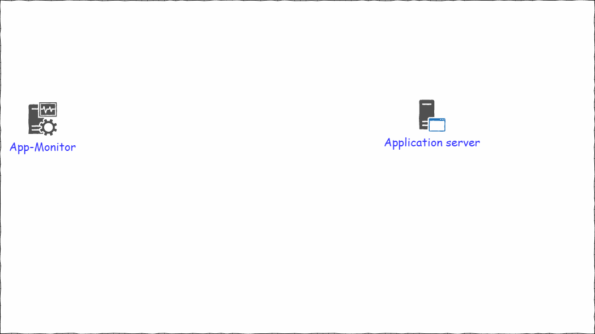
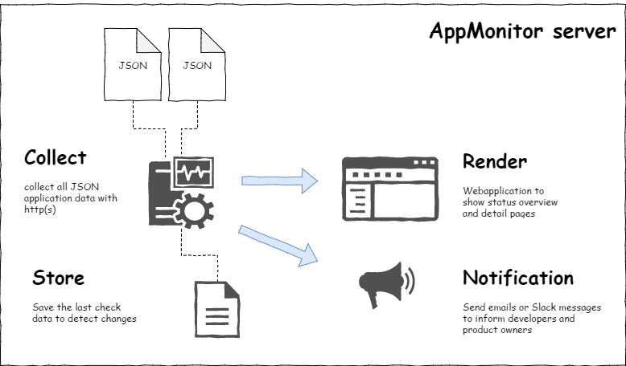

# [APPMONITOR](../readme.md) > Overview #
Free software and Open Source from University of Bern :: IML - Institute of Medical Education

https://github.com/iml-it/appmonitor

- - -

# How does it work? #

The appmonitor is a monitoring tool that consists of 2 parts
- **client** (for each webapplication to check)
  - makes necessary checks for the full functionality of a website 
  - uses the credentials of the application
  - responds information as JSON
- **server** instance
  - collects all JSON data and presents an overview over all checks and websites
  - sends notifications to server admins (read from server config) plus developers and product owners (coming from clients metadata)

# Installation #

Go to page [Server](server.md) to install the server that contains the server and client components.

# Workflow #

The server should run as a deamon (but this is not a must).
It collects all monitoring data from all your web apps by sending an http(s) request.

The health-check is done from the view of the application server.

The client sends back a result in JSON format.

# Clients #

For PHP applications a client with pre defined checks is delivered.

For Non-PHP clients you need to write your own checks and create a response in the pre defined syntax.
  

**more**: [Client](client.md) | [PHP-Client](client-php.md)

# Server #

After collecting all results it stores the results. It renders a web gui and sends notifications.

**more**: [Server](server.md)

