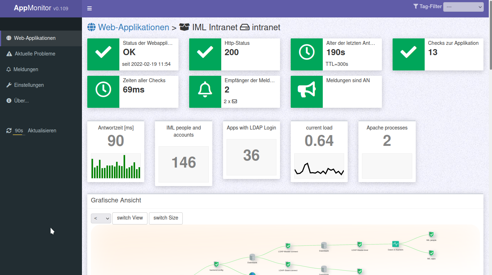

# APPMONITOR

The application monitor is a complementing tool next to the classic system monitoring of servers and its services.

Free software and Open Source from University of Bern :: IML - Institute of Medical Education

📄 Source: <https://github.com/iml-it/appmonitor> \
📜 License: GNU GPL 3.0 \
📗 Docs: <https://os-docs.iml.unibe.ch/appmonitor/>

## Related projects

* **Appmonitor CLI client** \
Compiled binary with all PHP checks \
📄 Source: <https://git-repo.iml.unibe.ch/iml-open-source/appmonitor-cli-client> \
📗 Docs: <https://os-docs.iml.unibe.ch/appmonitor-cli-client/>

* **IML Healthomintor** \
A public instance to show the health status of your applications to a public audience. \
📄 Source: <https://git-repo.iml.unibe.ch/iml-open-source/healthmonitor> \
📗 Docs: <https://os-docs.iml.unibe.ch/healthmonitor/>

* **Appmonitor API clients** \
Client examples for Bash and PHP to fetch the API. The PHP class in this project is used in the Healthmonitor to fetch data from the IML Appmonitor API.\
📄 Source: <https://github.com/iml-it/appmonitor-api-client> \
📗 Docs: <https://os-docs.iml.unibe.ch/appmonitor-api-client/>

* **POC Dashboard** \
Html+Javascript Dashboard that can run locally without a webserver. It uses fetch() with Basic authentication for cross origin requests. \
📄 Source: <https://git-repo.iml.unibe.ch/iml-open-source/appmonitor-dashboard/>
